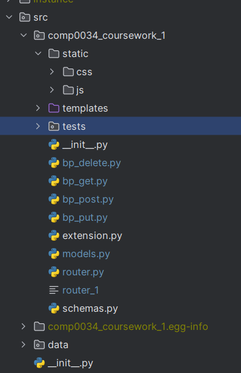

## COMP0034 Coursework 1 2023/24

# My Python Package

This is `my_package`, a Python package designed to offer exceptional functionality. 

## Package Structure

Below is the directory structure of `my_package`, illustrating the organization and key components of the package:

## Test Suite

The test suite includes files that cover a range of HTTP methods:

- `conftest.py` configures the testing environment, including the setup of test data in JSON format.
- `test_delete_functions.py` contains tests for DELETE operations.
- `test_get_functions.py` contains tests for GET operations.
- `test_post_functions.py` contains tests for POST operations.
- `test_put_functions.py` contains tests for PUT operations.

## Routing and Configuration

- `__init__.py`: Defines the `create_app()` function to initialize the Flask app and configures it to read from a CSV file.
- `bp_delete.py`, `bp_get.py`, `bp_post.py`, `bp_put.py`: These are blueprint files used to establish routes within the router.
- `extension.py`: Imports and initializes the database (`db`) and Marshmallow (`ma`) instances.
- `router.py`: Enables direct execution of the app through the code, useful for development and testing.
- `models.py`: Manages database models, providing an abstraction layer over the database.
- `schemas.py`: Contains Marshmallow schemas that facilitate serialization and deserialization of database models to and from JSON format.

Remember to replace `img.png` with the actual path to your image if it's located in a different directory or has a different filename.

